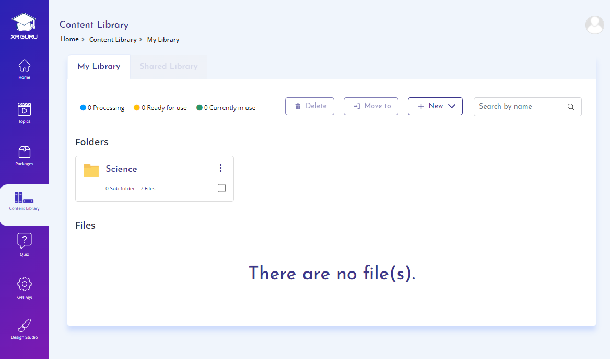
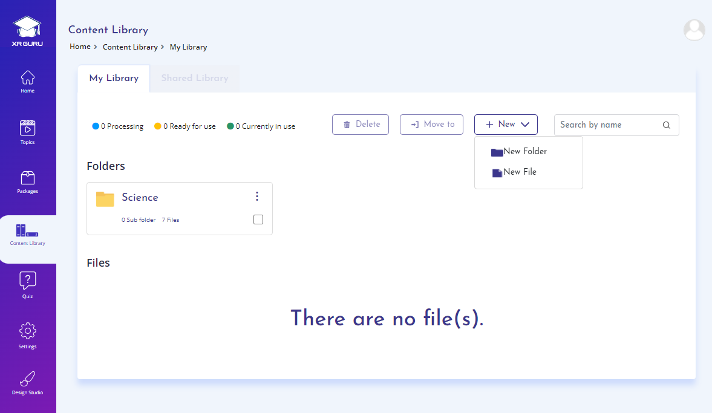
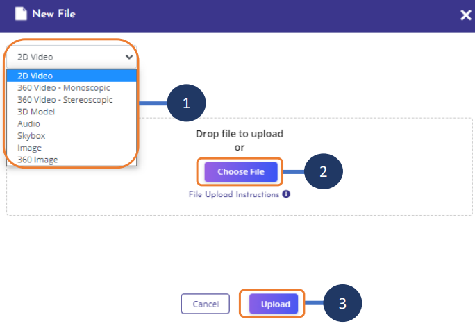
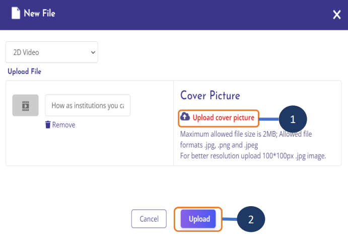
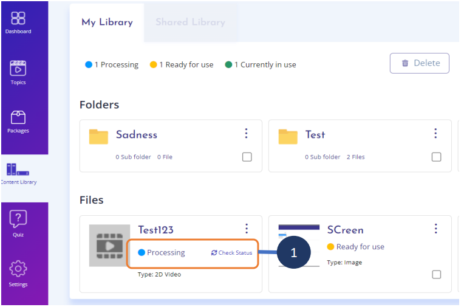

# Content Library
The Content Library is the repository where you upload the files
that you want to use in creating your learning topics.

- Create folders to organize your content files
- Upload files into a Topic or Topic folder
- Edit, move, download or delete files
- Use the files as Topic content
- Use the files as part of a Design Studio project
(linked to the Topic)

# File Types
- 3D Models
- 2D Videos, 2D Images
- 360 Videos, 360 Images
- Design Studio files

# File Status
- Processing the file before it is ready for use.
- Ready for use – File is available for use in a topic or in Design
Studio.
- Currently in use – File is already in use as part of the topic or a
Design Studio project.

# Design Studio
Files from the Content Library display under My Library in
Design Studio.

# Create a new file

The content library is a repository where you can create and manage different files like images, 360
images, 2d Videos, 360 Monoscopic and Stereoscopic videos, Skyboxes, 3D models and Audio files.

Using the controls available within the content library you can edit, move, download and delete the files
that you have created.

Create folders within content library to organize the files that you have created.

The files thus created can be used directly as a topic content or used as part of XR DS project and linked
to a topic.

 

1. Click on Content Library menu
2. Click on New dropdown
3. Choose New file

# Choose file type
 

1. Choose the preferred file type from
dropdown.
2. Click on Choose File button to select file
from your local device.
3. Click on Upload button.

### Note:
- File types Image & 360 image does not require a
cover picture(thumbnail).

# Upload cover image
 

1. Click on Upload Cover picture to choose
file from your local device
2. Click on Upload button

# Check file status
 

1. Click on check status to check the status
of the file that is under processing.

### Note:
- File types 2D video, 360 video and 3D
model will be processed before it is
ready for use
- When the processing is complete, status
of the file changes to Ready for use.

