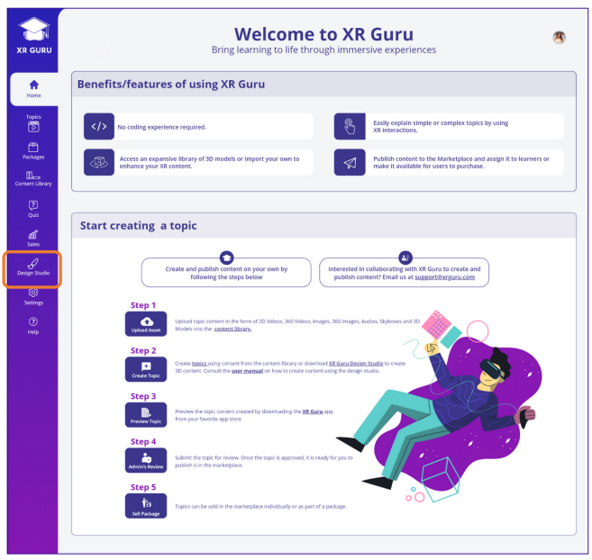

# Creator Homepage

XR Guru’s Creator Homepage lets users quickly access the features they need to build their courses. 
- Users can use the left panel to move easily access your licensed applications.
- The middle panel provides users with the steps needed to create learning topics.
 
  

 
 # Design Studio Authoring Tool
 
Design Studio is XR Guru’s authoring tool that provides content
creators with features and capabilities to create immersive
learning experiences.
Content creators can easily use Design Studio without coding
experience.
Content creators can use their own assets or choose from
thousands of preloaded assets, including 3D animations,
videos, and images.

## **Features**

- Use predefined actions and scripts to add labels and gestures to 3D models
- Add 3D models, 2D videos, 2D images, 360 images, audio, text, and hotspots
- Publish content to the XR Guru Marketplace to share withstudents or learners
- Sell your published content through the XR Guru Marketplace for a return on investment (ROI)

## **System Requirements**

- Operating Systems – Windows XP, Vista (7, 8.1, 10)
- RAM – 1 GB
- Hard Disk – 1.5 GB
- Processor – Intel dual core processor or higher 

# Download

| [DownLoad](https://content.xrguru.com/XRDS/Prod/Build/XRGDS.exe) | Version 2.8 |
| ---------------------------------------------------------------- | ----------- |
|                                                                  |             |

 

