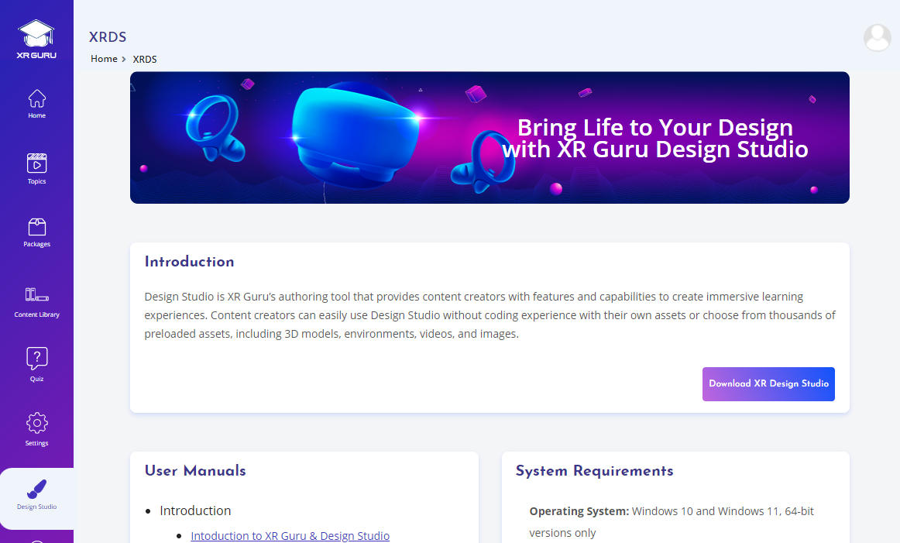
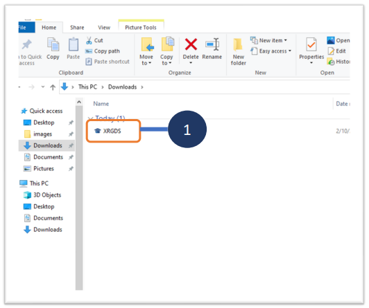
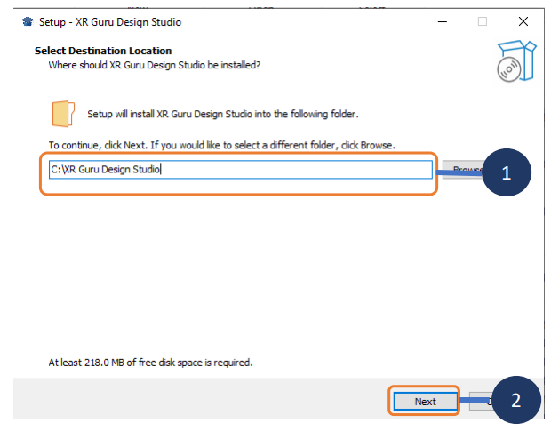
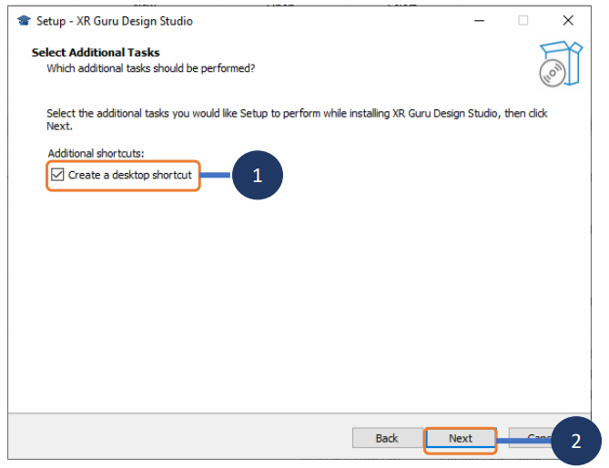
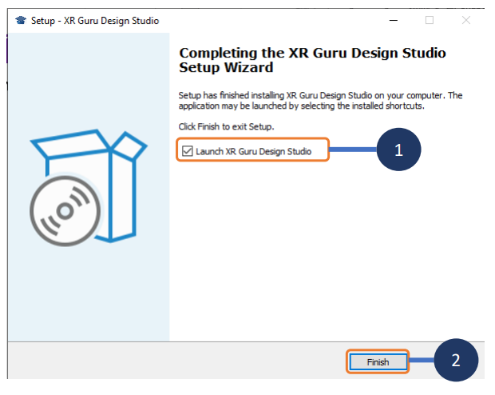
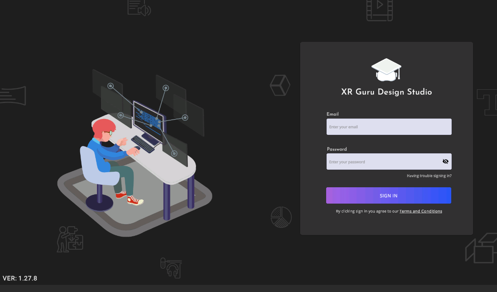

# Design Studio 
Design Studio is XR Guru’s authoring tool that provides content creators with features and capabilities to create immersive learning experiences. Content creators can easily use Design Studio without coding experience with their own assets or choose from thousands of preloaded assets, including 3D models, environments, videos, and images.

# Download XR Guru Design Studio

1. Click on the Design Studio menu from the
left navigation bar.

2. Click on the button Download XR
Design Studio.
Note:
On clicking the button, the installable
exe file will get downloaded to your device.

# Install the XR Guru Design Studio

1. Double click on the installable exe file to
start the installation process.

1. Select the preferred location from your
device for installing the application.
2. Click on Next Button

# Launch the Design Studio 

1. Check the box to Launch XR Guru
Design Studio
2. Click on Finish button.
### Note:
- On clicking the Finish button, the Design
Studio gets launched.
- Other ways to launch the design studio is
to click on the desktop shortcut icon or
search for XR Guru Design Studio in the
apps installed in the device.

# Login to Design Studio

1. Enter the Email that you used for
registering as a Creator with XR Guru.
2. Enter the Password.
3. Click on SIGN IN button to enter the
application and start creating the
projects.

