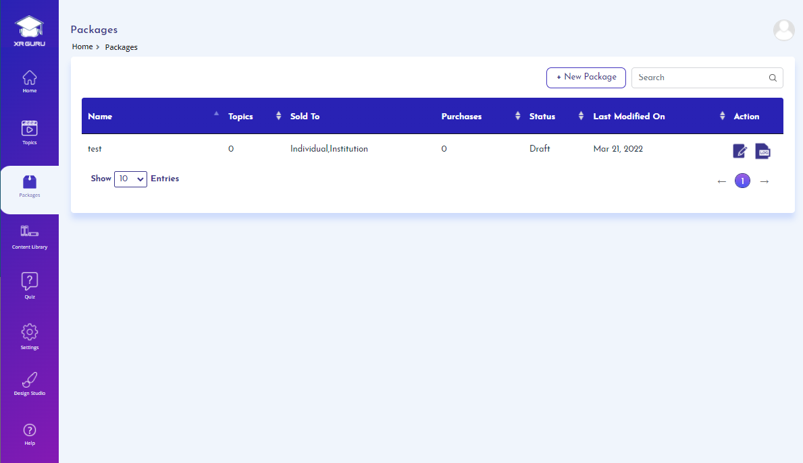

# Packages
A package is a collection of topics that are grouped based on
subject, grade level, educational board, entrance exam, licensing
certification, or other educational or academic criteria.
A Package includes information on the subject matter, course
objectives, and learning outcomes. It contains a list of topics
grouped from the respective category.

 
 

# Required
- Name
- Price
- Category

# Marketplace
- You can choose to sell a package in the marketplace by setting a
price for Individual customers or Institution customers, or both.

# Package Status
- The system provides the status of a package, such as draft,
pending review, or cancelled by the publisher.
- The Admin is the person with authority to approve or reject a
package. If the package is approved, the package can be
published and assigned to users or placed in the marketplace.

# Create a Package
 
# Step1 

1. Click on Packages menu
2. Click on New Package button

# Step2

1. Enter package name.
2. Enter package description.
3. Choose to sell this package to Individual or
Institution or for both.
4. Select Duration and enter pricing information.
5. Click on Save & Continue.

### Note:
1. You can save the package in draft status for later by clicking on “Save as Draft” button.

# Step3

1. Select the topics for creating the package.
2. Move the selected topics to the righthand side table.
3. Select the categories under which the
package should list in the marketplace.
4. Click on Submit for Review button.

# Note:
- On submitting the package for review, the admin will get notified and after review
they will approve or reject the package. 
-You will be notified via email when the package gets approved or rejected by admin
