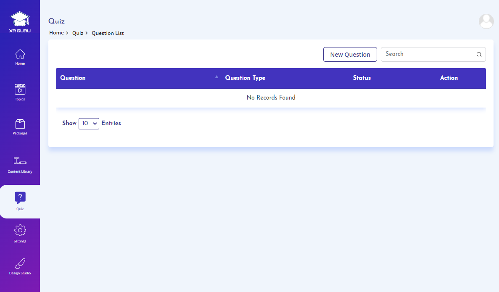

# Quiz
XR Guru provides five (5) types of quiz questions that you
can use when creating a quiz.

 
- Multiple Choice – Single Selection
- Multiple Choice – Multiple Selection
- Matching
- Cycle Quiz
- Puzzle Image Arrangement

# Required
- Quiz Name
- Quiz Description
- Duration
- Question Type
- Question
- Answer Explanation

# Optional Settings
- Shuffle Question
- Status – Active or Inactive
- Text or Image

# Create a new Quiz

1. Click on the Quiz menu to
navigate to the quiz listing page.
2. Click on New Quiz button from
the quiz listing page.

1. Enter Quiz name and Quiz description
2. Select Yes/No if you like to shuffle the
questions or let the student take the
answer questions in the order you have
created.
3. Set the quiz Duration.
4. Set status as Active or Inactive
5. Click on Save & Proceed button
Note:
1. Create a quiz and have it in “Inactive”
status to continue editing the quiz until it
is ready for use.

# Create a new Question

1. Choose preferred question type from
dropdown.

1. Select Question Type as Text or Image,
enter text or upload image based on the
selection you have made.
2. Select Answer Type as Text or
Image, enter text or upload image based
on the selection you have made. 

# Create a Multiple-Choice Single Selection Question

1. Select option type as Text or Image. enter text
or upload image based on the selection you
have made.
2. Set Status as Active or Inactive.
3. Click on create button
### Note:
- Question status can be made “Active” if it is
ready for use and if not ready, you can set the
status as “Inactive” and continue editing the
question.

# Multiple-Choice Multi Selection Question

1. Select option type as Text or Image.
enter text or upload images based on the
selection you have made. 

1. Select the correct answers for multichoice multi selection question type.
2. Set status to Active or Inactive.
3. Click on create button
Note:
1. Multiple answers can be selected as correct
answers for Multi-choice multi selection question
type.

# Matching type Question

1. For matching type questions, enter the
matching options in the correct order.
This order will be shuffled for the
students when they attempt the
question.
2. Set status to Active or Inactive.
3. Click on create button.

# Cycle type Quiz

1. For cycle type question, select the type
Text or Image to enter text or upload
image in the correct sequence. This order
will be shuffle for the students when they
attempt the question.
2. Set status to Active or Inactive.
3. Click on create button.

# Puzzle type Quiz

1. For puzzle type question, enter the
question.
2. Click on choose file to upload the correct
image. The image that you uploaded will
be broken up and shuffled for the
students when they attempt this
question.
3. Set status to Active or Inactive
4. Click on create button
