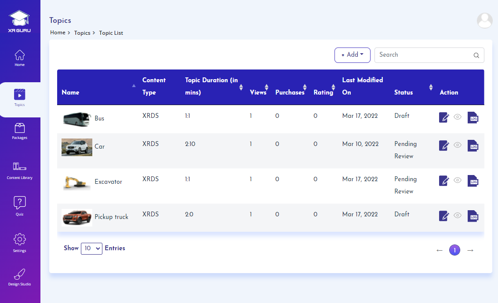

# Topics

1. The topic refers to the actual study material that the end user will be learning.
2. Topic includes the information on subject matter like the topic name, description on learning objectives, learning 
  outcomes, learning duration, topic content in the form of 2d video, 360 video, 3d animation, XR Guru Design Studio content.

3. In addition to this linking quizzes to a topic for letting the students to practice their learning.
4. You can choose to sell a topic in the marketplace by setting a price for either or both individuals and institutions.
5. Topics can be sold individually or as a package in the marketplace.

A topic refers to the subject matter that is presented to the
learner. Topics consist of the following:

## Required

- Topic Name
- Category
- Topic Duration
- Supported Devices
- Topic Thumbnail
- Introduction Images
- Content Type
- Project (Design Studio)

## Optional

- Topic Description
- Quiz (Linked)
- Marketplace (Sell this topic)
- Comments (User feedback)

## File Types

- 3D Models
- 2D Videos, 2D Images
- 360 Videos, 360 Images
- Design Studio files

## Marketplace
- You can choose to sell a topic in the marketplace by setting a
price for Individual customers or Institution customers, or both.
- Topics can be sold individually or as a package in the
marketplace.

## Topic Status
- The system provides the status of a topic, such as draft, pending
review, or cancelled by the publisher.
- The Admin is the person with authority to approve or reject a
topic. If the topic is approved, the topic can be published and
assigned to users or placed in the marketplace.

# Create a new topic

1. Click on Topics Menu
2. Click on Add button
3. Choose New Topic from dropdown

1. Enter topic name
2. Choose the category from dropdown under which the topic should get listed in themarketplace.

#### Note:
- Topic description is not mandatory, but you can provide more information to the learner about the topic.

# Add supported devices and associate category
 

1. Choose the devices in which the topic content is supported.
2. Upload Topic Thumbnail image for each device by drag & drop or click to upload file from your local device.
3. Upload Introduction Images by either drag & drop or click to upload files from your local device.
4. Choose the preferred content type from dropdown

1. After selecting content type 2D Video, 360 video, click on "Choose from Library" to add files from content library popup.
2. Choose the file from the popup and click on Add button.

#### Note:
- If no files are available, click on click here link to add new file into content library and then use them as topic content.

# Add the topic content

1. After selecting content type 2D Video, 360 video, click on "Choose from Library" to add files from content library Popup.
2. Choose the file from the popup and click on Add button.

#### Note:
- If no files are available, click on click here link to add new file into content library and then use them as topic content.

1. If the content type selected is “XRDS”
2. Select the XR DS project from the dropdown
#### Note:
- If no projects are available to select, create the project in XRDS and then use them as topic content.

# Set topic duration and associate quiz

1. Set topic duration from dropdown
2. Choose any number of quizzes from dropdown to associate a quiz to the topic.

#### Note:
- If no quiz is available, create a new quiz

# Set price for topic

1. Choose to "Sell this topic to" either individuals & institutions or both or skip to sell it as part of a package.
2. Select the duration from dropdown. Set a minimum number of licenses required for an institution to purchase this topic (Not
required for Individual). Set Actual price of the topic and enter special price if you would like to allow a discount.
3. Click on "+" icon to add more durations.

# Add comments for the reviewer

1. Add comments to the reviewer if required.
2. Click on add attachment button to upload any references for the reviewer you would like to submit.
3. Click on submit for review button to submit the topic for admin’s review andapproval.

